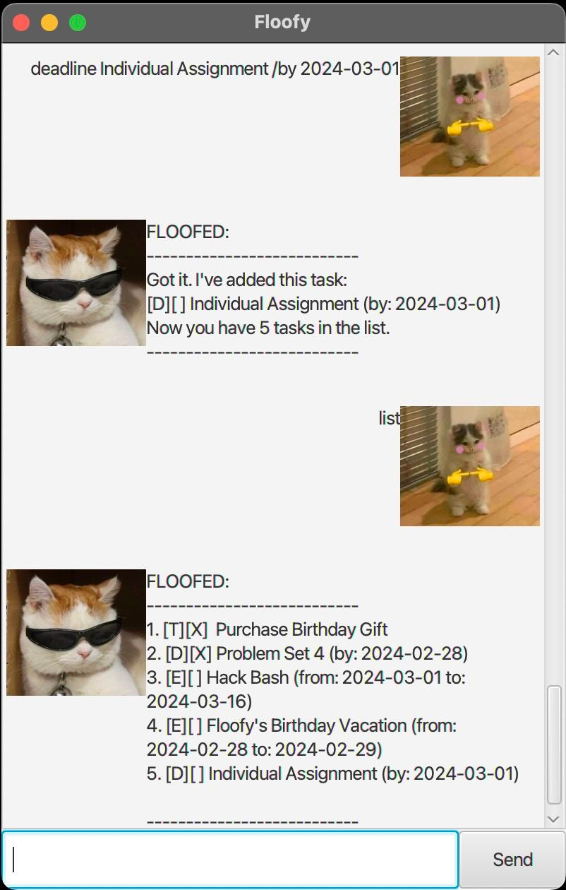

# Floofy User Guide

### _!! ATTENTION !! everyone needs a *FLOOFY* in their life XD_


Floofy is YOUR personal chatbot assistant that helps you manage your tasks and deadlines.

It's __SIMPLE__ TO USE, and it's _FREE_! 

Swarmed with tasks and events to keep track of? Floofy's got ___YOU___ covered! 

## How to _FLOOF_ with Floofy

### 1. Add a `ToDo` task to your task list
>For tasks that don't have a deadline

Format: `todo <description>`

ShorterFloofs: `t`, `td`

e.g. `todo read book` / `t read book`

```
Got it. I've added this task:
[T][] read book
Now you have 1 task in the list.
```

### 2. Add a `Deadline` task to your task list

> For tasks that need to be completed by a specified deadline

Format: `deadline <description> /by <yyyy-mm-dd>`

ShorterFloofs: `ddl`, `dln`

e.g. `deadline return book /by 2024-04-10` / `ddl return book /by 2024-04-10`

```
Got it. I've added this task:
[D][] return book (by: 2024-04-10)
Now you have 2 tasks in the list.
```

### 3. Add an `Event` to your task list

> For tasks that start and end on specific dates

Format: `event <description> /from <yyyy-mm-dd> /to <yyyy-mm-dd>`

ShorterFloofs: `evt`, `ev`, `e`

e.g. `event Annual Book Fair /from 2024-04-10 /to 2024-04-11`

```
Got it. I've added this task:
[E][] AGM (from: 2024-04-10 to: 2024-04-11)
Now you have 3 tasks in the list.
```

### 4. List all tasks
> To view all tasks in your list

Format: `list`

ShorterFloofs: `ls`, `l`

e.g. `list`

```
1. [T][] read book
2. [D][] return book (by: 2024-04-10)
3. [E][] Annual Book Fair (from: 2024-04-10 to: 2024-04-11)
```

### 5. Mark a task as "done"

> To mark a task that has been completed

Format: `mark <task index>`

ShorterFloofs: `mk`, `m`

e.g. `mark 2`

```
Nice! I've marked this task as done:
[D][X] return book (by: 2024-04-10)
```

### 6. Marking a task as "not done"

> To mark a task as incomplete

Format: `unmark <task index>`

ShorterFloofs: `um`, `u`

e.g. `unmark 2`

```
OK, I've marked this task as not done yet:
[D][] return book (by: 2024-04-10)
```

### 7. Find tasks by keyword

> To search for tasks that contain a specific keyword

Format: `find <keyword>`

ShorterFloof: `f`

e.g. `find book`

```
Here are the matching tasks in your list:
1. [T][] read book
2. [D][] return book (by: 2024-04-10)
```

### 8. Delete a task

> To delete a task from your list

Format: `delete <task index>`

ShorterFloofs: `del`, `dlt`

e.g. `delete 2`

```
Noted. I've removed this task:
[D][] return book (by: 2024-04-10)
Now you have 2 tasks in the list.
```

### 9. Say bye to Floofy 

> Just for fun! 

Format: `bye`

ShorterFloof: `b`

e.g. `bye`

```
Bye. Hope to see you again soon!
```

### !! Important Messages From Floofy !!
> Your tasks are saved automatically, so you don't have to worry about losing them.

> __Acknowledgement:__ The development of Floofy was accelerated with the use of GitHub Co-Pilot. 
> With that, you may look forward to EVEN BETTER versions of Floofy in the near future 
> as we continue developing at __*LIGHTNING SPEED*__.